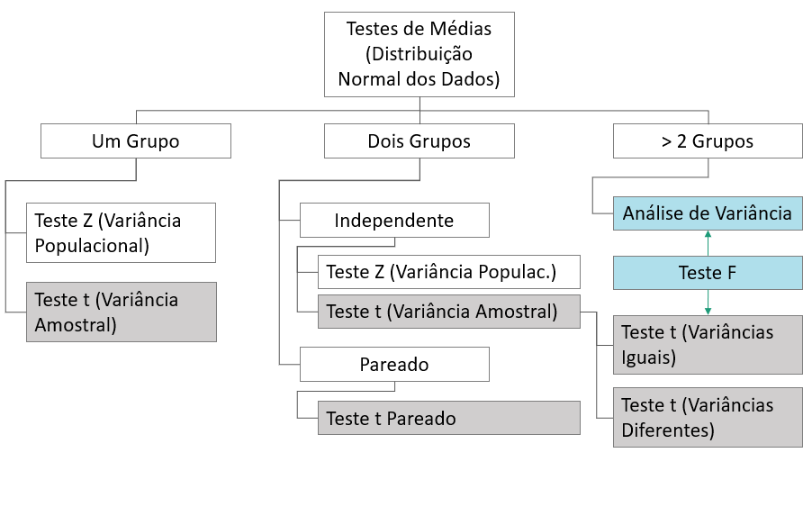
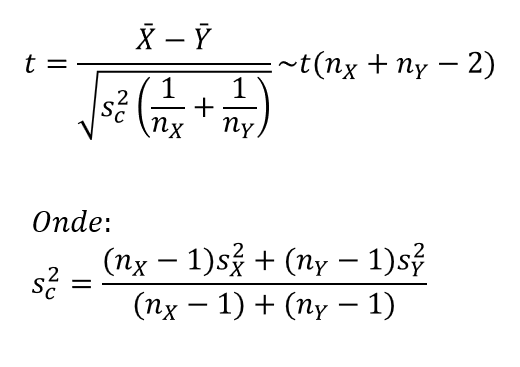
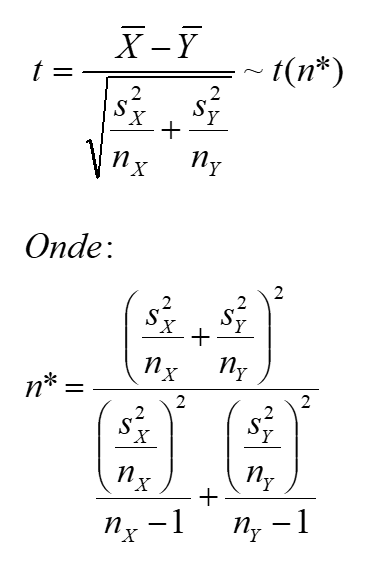

# Teste t Para Duas Médias

```{r setup, include=FALSE}
knitr::opts_chunk$set(echo = TRUE)
```

## Teste t de Student para dois grupos ou médias independentes

- Consiste em uma comparação simples de dois tratamentos de um fator
- As amostras devem ser independentes
- Isso quer dizer que as unidades experimentais para cada tratamento são diferentes
- As variâncias populacionais não são conhecidas
- Adimite-se a presuposição de normalidade
- Deve ser verificada a homogeneidade das variâncias

```{r}

```

## A.Variâncias Homocedásticas

Os dados que seguem são relacionados a cinco determinações da resistência (mpa) para dois tipos de concreto.
Ao nível de 5% de significância, há evidência de que a resistência entre os dois tipos de concretos é diferente?

Os dados seguem abaixo:

```{r ex.1, echo = TRUE}
c1 <-c(54,55,58,51,57); c1
c2 <-c(50,54,56,52,53); c2
```

### Análise Exploratória

```{r exp, echo = TRUE}
mean(c1) # Média c1
mean(c2) # Média c2
var(c1) # Variância c1
var(c2) # VAriância c2
```

### Gráfico Box-Plot

```{r boxplot1, echo = TRUE}
boxplot1 <- boxplot(c1, c2)
```

### Pressuposição de Normalidade

```{r norm, echo = TRUE}
shapiro.test(c1)
shapiro.test(c2)
```

### Teste de Homogeneidade das Variâncias

- Teste F > 1 unilateral à direita
- O primeiro vetor deve conter o conjunto de dados de maior variância!
- Ho: sig^2(1) = sig^2(2)
- Ha: sig^2(1) > sig^2(2)

```{r vartest, echo=TRUE}
var.test(c1, c2, alternative = "greater")
gginference::ggvartest(var.test(c1, c2, alternative = "greater"))
```

### Teste t para variâncias homocedásticas

- H0: mu(1)  = mu(2)
- Ha: mu(1) != mu(2)

```{r test, echo=TRUE}

t.test(c1 , c2 ,alternative='two.sided', var.equal=TRUE)
```

### Gráfico do teste t

```{r graf}
gginference::ggttest(t.test(c1 , c2 ,alternative='two.sided', var.equal=TRUE))
```

## B. Variâncias Heterocedásticas

Os dados que seguem são relacionados a cinco determinações da resistência (mpa) para dois tipos de concreto.
Ao nível de 5% de significância, há evidência de que o concreto 1 é mais resistente?

Os dados seguem abaixo:

```{r ex.2, echo = TRUE}
c.1 <- c(54,55,58,51,57); c.1
c.2 <- c(40,34,56,72,63); c.2
```

### Análise Exploratória

```{r exp1, echo = TRUE}
mean(c.1); mean(c.2); var(c.1); var(c.2)
```

### Gráfico Box-Plot

```{r box1, echo = TRUE}
boxplot(c.1, c.2)
```

### Pressuposição de Normalidade

```{r norm1, echo = TRUE}
shapiro.test(c.1)
shapiro.test(c.2)
```

### Teste de Homogeneidade das Variâncias

- Teste F > 1 unilateral à direita
- O primeiro vetor deve conter o conjunto de dados de maior variância!
- Ho: sig^2(1) = sig^2(2)
- Ha: sig^2(2) > sig^2(1)

```{r vartest1, echo=TRUE}
var.test(c.2 ,c.1,alternative='greater') # Vetor c.2 de maior variância
 gginference::ggvartest(var.test(c.2 ,c.1,alternative='greater'))
```

### Teste t para variâncias heterocedásticas

- H0: mu(1) = mu(2)
- Ha: mu(1) > mu(2)

```{r test1, echo=TRUE}

t.test(c.1, c.2, alternative='greater', var.equal=FALSE)
```

### Gráfico do teste t

```{r graf1}
library(gginference)
gginference::ggttest(t.test(c.1 , c.2 ,alternative='greater', var.equal=TRUE))
```