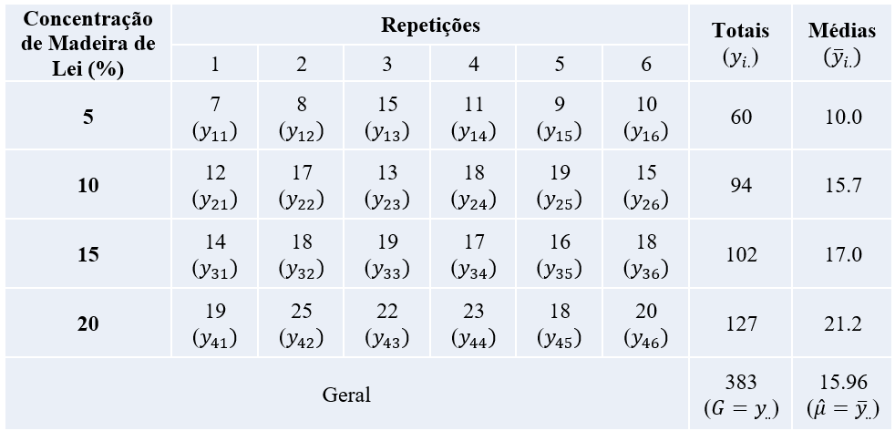
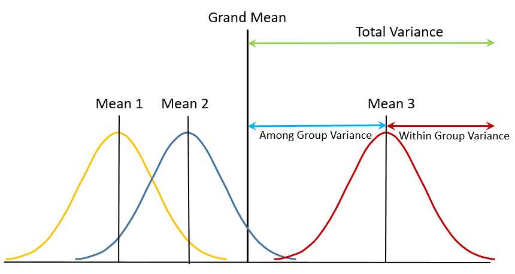
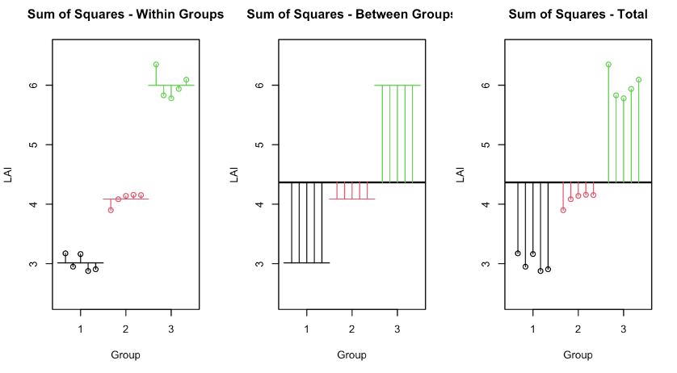
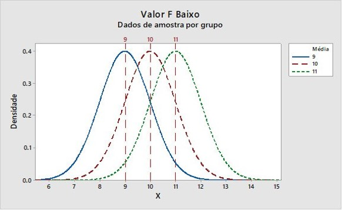
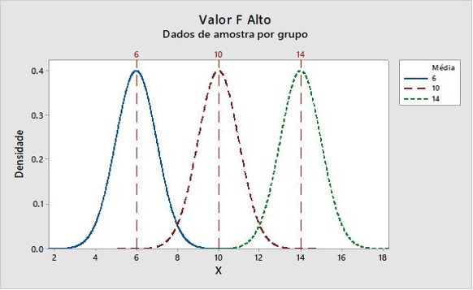

# ANOVA - Delineamento Inteiramento Casualizado

## Introdução

- O Delineamento Inteiramente Casualizado (DIC) é o de mais simples aplicação
- Utilizado quando temos um único fator em análise e seus diferentes níveis ou grupos (tratamentos)
- Consiste na casualização completa dos tratamentos às unidades experimentais
- Envolve os seguintes princípios experimentais:
    - Repetição
    - Casualização
- Não há blocagem ou controle local pois as unidades experimentais são homogêneas

**Exemplo**

Um fabricante de papel está interessado em melhorar a qualidade do seu produto. A engenharia do produto pensa que a **resistência à tração** seja uma função da **concentração de celulose na madeira** e a que a faixa prática de interesse das concentrações esteja entre 5 e 20%. Um grupo de engenheiros responsáveis pelo estudo decide investigar **quatro níveis de concentração: 5, 10, 15 e 20 %**. Eles decidem fabricar **seis corpos de prova para cada nível de concentração**, usando uma planta piloto. Todos os **24 corpos de prova** são testados, **em uma ordem aleatória**, em um equipamento de teste de laboratório, em que é mensurada a resistência à tração (psi=libra/polegada^2^). Verifique se a concentração de celulose apresenta efeito siginifcativo na resistência à tração (alfa = 5%). Os dados desse experimento são mostrados a seguir.

### Interpretação

O que nós estamos testando? Qual o objetivo do experimento?

- Verificar o efeito da concentração de celulose da madeira na resistência à tração do papel.
  - Concentração de celulose: Variável Independente (1 Fator em estudo)
    - Quatro níveis (5, 10, 15 e 20) ou Quatro tratamentos
    - Natureza da variável: Quantitativa
  - Resistência à tração: Variável Resposta (Quantitativa)
    - Natureza da variável: Quantitativa
  
- Caracterização:
  - I = 4 tratamentos
  - J = 6 repetições
  - N = I*J = 24 unidades experimentais

### Dados

**Tabela 1.** Resistência (psi) à tração do papel em função da concentração de madeira de lei (%)

```{r tab1, out.width="100%"}

```

### Input de Dados

- Podemos importar o data set a partir de um documento txt
- Nessa operação vamos criar um data-frame com dois vetores
  - conc_%: vetor da variável independente
  - r_trac: vetor da variável resposta

```{r data, echo=TRUE}
dados <- read.table("dados/ex_01_dic.txt", header = TRUE)
head(dados)
```

### Estrutura do Data-Frame

- Podemos verificar a estrutura do nosso data-frame

```{r str, echo=TRUE}
str(dados)
```

- Para a ANOVA temos que transformar o vetor da variável independente em fator

```{r transf, echo=TRUE}
dados$conc <- as.factor(dados$conc)
str (dados)
```

### Análise Gráfica Exploratória

- Histograma da distribuição da variável resposta:

```{r hist1, echo=TRUE}
hist1 <- hist(dados$trac)
```

- Box-Plot da variável resposta em função dos tratamentos

```{r boxploty, echo=TRUE}
boxplot(trac ~ conc, data= dados)
```

- Um gráfico dot-plot mais elaborado com base no pacote ggplot2:

```{r dotplot, message=FALSE, echo=TRUE}
library(ggplot2)
ggplot(dados, aes(x = conc, y = trac)) +
  geom_dotplot(binaxis = 'y', stackdir = 'center', dotsize = 0.5) +
  stat_summary(fun.data = mean_sdl, fun.args = list(mult = 1),
                 geom = "pointrange", colour = "red") +
    theme_classic()
```

## Modelo Estatístico

### Modelo Estatístico (1)

- É um modelo linear:

  yij = mu + ti + eij

- Onde:

  yij = observação da variável resposta para o i-ésimo tratamento e a j-ésima repetição;
  mu = média geral;
  ti = efeito do i-ésimo tratamento;
  eij = erro experimental com a pressuposição eij ~ NID(0; sigma^2)

**Significa que vamos decompor as observações (dados coletados) no efeito da média geral, dos tratamentos e do erro experimental**

### Modelo Estatístico (2)

- É um sistema de equações lineares:

| yij | =  | mu    | + | ti    | + | eij    |
|:---:|:--:|:-----:|:-:|:-----:|:-:|:------:|
| 7   | =  | 15.96 | + | -5.96 | + | -3.00  |
| 8   | =  | 15.96 | + | -5.96 | + | -2.00  |
| 15  | =  | 15.96 | + | -5.96 | + |  5.00  |
...

Veja que:

- mi = mu + ti
- ti = mi - mu
- eij = yij - mi

## Análise de Variância

### Análise de Variância (1)

- Para resolver o problema da análise de médias para dois ou mais grupos utilizamos a Análise de Variância

- Vamos testar a hipótese:
  - Ho: m1 = m2 = m3 = m4 = mu
  - Isso corresponde a dizer que não existe o efeito de tratamentos no modelo e todas as médias são estatisticamente iguais à média geral

- A hipótese alternativa pode ser dada por:
  - Ha: Pelo menos uma média é diferente das demais
  - Ou seja, existe  influência do efeito de tratamentos no modelo. Pela ANOVA não podemos saber diretamente aonde estão estas diferenças. Mas "algo" está acontecendo em relação aos tratamentos testados

### Análise de Variância (2)

- A técnica da ANOVA é uma decomposição da variância total nas variâncias dos efeitos do modelo. Veja a figura abaixo:

```{r figanova1, out.width="100%"}

```

**Figura.** A técnica da ANOVA consiste em investigar as variâncias do modelo, através de uma descomposição de variâncias. A variância total é relativa à média geral (na figura 'Grand Mean'). A variância dos tratamentos é a relação entre as médias dos tratamentos ('Among Group Variance') e a média geral. A variância residual (devida ao Erro Experiomental) é a variância dentro dos grupos de médias ('Within Group Variance'), que consiste nos desvios de cada observação em relação à média de cada grupo (ou média de cada tratamento)

#### Decomposição das Somas de Quadrados (SQ)

- Sabemos que uma variância pode ser calculada por:

- S^2^ = SQD / gl
  - Em que:
  - SQD = Soma de Quadrados de Desvios
  - gl = Graus de Liberdade
  
- Portanto, vamos iniciar a decomposição via Somas de Quadrados (SQ) para cada efeito do modelo:

- yij = m + ti + eij

- SQTotal = SQTrat + SQRes

  - SQTotal = ∑(yij - mu)^2^ (Desvios Quadráticos das observações em relação à média geral)
  - SQTrat = J∑(mi - mu)^2^ (Desvios Quadráticos das médias de tratamentos em relação à média geral)
  - SQRes = ∑(yij - mi)^2^ (Desvios Quadráticos das observações em relação às médias de tratamentos)
  
```{r figsq 1, out.width="100%"}

```

**Figura.** Exemplo de decomposição das Somas de Quadrados de um modelo estatístico no DIC. A Soma de Quadrados do Total (SQTotal) permite calcular os desvios quadráticos entre cada observação (yij) e a média geral (mu). A Soma de Quadrados de Tratamentos (SQTRat), que corresponde a variação entre grupos (Between Groups), consiste em calcular os desvios quadráticos das médias dos tratamentos (mi) e a média geral, permitindo computar a variação devido aos efeitos dos tratmentos. A Soma de Quadrado Residual (Dentro de Grupos) envolve o cálculo dos desvios de cada observação em relação à média dos tratamentos. Estes desvios correspondem à uma estimativa da variação do erro experimental.

### Análise de Variância (3)

- ANOVA é uma decomposição das variâncias do modelo

- O que é uma variância?

- S^2^ = SQD / gl

- Já temos as Somas de Quadrados calculadas. Portanto, devemos calcular os Graus de Liberdade (gl) para cada fonte de variação do modelo:

  - gl(Total) = I*J - 1 = N - 1 = 24 - 1 = 23
  - gl(Trat) = I - 1 = 4 - 1 = 3
  - gl(Res) =  gl(Res) = gl(Total) - gl(Trat) = 23 - 3 = 20

### Análise de Variância (4)

- Finalmente podemos calcular as variâncias para as fontes de variação do efeitos do modelo.

- Basta dividir as SQ pelo número de graus de liberdade correspondente:

- Na ANOVA vamos chamar as variâncias de Quadrados Médios

  a) QMTotal = SQTotal / gl(Total)
  b) QMTrat = SQTrat / gl(Trat)
  c) QMRes = SQRes / gl(Res)

- Agora vamos utilizar o teste F para verificar se a variância dos efeitos de tratamentos (QMTrat) é maior do que a variância resiual ou do erro experimental (QMRes):

  - F = QMTrat / QMRes

### Análise de Variância (5)

- A ANOVA pode ser realizada através de um comando simples no R

```{r anova1, echo=TRUE}
modelo <- aov(trac ~ conc, data = dados) # Ajuste do Modelo
anova(modelo) # Obter a tabela da ANOVA
```
- O F calculado de F = 19,6 indica que o QMTrat (que é a variância dos efeitos dos tratamentos) é 19 vezes maior que o QMRes (Variância do Erro Experimental)

- Associado a este valor de F, temos o p-valor = 3.593e-06 muito reduzido.

- Os três asteriscos indicam que estamos rejeitando a hipótese H0 com um alfa próximo de 0% de probabilidade. Entretanto, o ideal é estabelcer um alfa previamente, que é probabildiade de erro tipo I (falso positivo). No exemplo, adimtimos um alfa = 0,05.

- Logo rejeitamos Ho: m1 = m2 = m3 = m4 = mu 

- Portanto podemos concluir que os efeitos dos tratamentos apresentam uma grande contribuição em relação à variação total e superior aos efeitos do erro experimental.

- Podemos dizer que os efeitos dos tratamentos (ti) exerce uma influência  significativa na resistência à tração e o nosso modelo explica bem a variação dos dados!

- Uma conclusão textual: "Pode-se verificar que as concetração de celulose na madeira apresenta efeito 'significativo' na resistência à tração do papel (alfa = 0,05)"

#### Interpretação do Teste F na ANOVA

- Podemos interpretar o teste F da seguinte forma:

```{r figanova2, out.width="100%"}

```

**Figura.** Quando o valor da estatística F = QMTrat/QMRes é baixo, as diferenças entre as médias dos tratamentos são pequenas em relação à variação residual. O 'tamanho' dessas diferenças é medido indiretamente pelo QMTrat. Nesse caso, o valor-p > alfa, levando à **não rejeição de H0**. Ou seja, nessas condições experimentais não é possível captar a influência dos tratamentos sobre a variável resposta.

```{r figanova3, out.width="100%"}

```

**Figura.** Quando o valor da estatística F = QMTrat/QMRes é alto, as diferenças entre as médias dos tratamentos são grandes em relação à variação residual. Nesse caso, o valor-p < alfa, levando à **rejeição de H0**. Ou seja, nessas condições experimentais é possível captar a influência dos tratamentos sobre a variável resposta, como é o caso do exemplo tabalhado.

### Análise de Variância (6)

- Podemos explorar de outra forma os resultados, considerando um modelo linear com suas inclinações

```{r anova2, echo=TRUE}
modelo2 <- lm(trac ~ conc, data = dados) # Modelo Linear com inclinação
summary(modelo2) # Obter efeitos do modelo
anova(modelo2) # Obter a tabela da ANOVA
```

## Análise das Pressuposições

### Análise das Pressuposições (1)

- Para validar o teste F, temos que estudar as pressuposições do modelo, que estão associadas ao erro experimental ou resíduo:
  - eij ~ NID(0;sigma^2^)
  - Normalidade dos Resíduos
  - Independência dos Erros
  - Homogeneidade das Variâncias

### Análise das Pressuposições (2)

- Análise Gráfica de Resíduos (ou Análise de Resíduos)

  - Para avaliar a homogeneidade das variâncias, utilizamos o gráfico de Valores Ajustados vs Resíduos
  
```{r anova3, echo=TRUE}
plot(modelo, 1)
```

**Figura.** Neste gráfico podemos observar a dispersão dos valores residuais em relação aos valores ajustados ('Fited values'). Os valores ajustados são exatamente os valores das médias de tratamentos. Agora, nosso modelo é um modelo de predição, dado apenas por 'yij = mi'. Nesse gráfico observamos a relação da variância dos resíduos (sigma^2^) para cada tratamento. Se as variâncias do erros são homogêneas, a dispersão dos erros para cada tratamento é próxima.

  - Também podemos avaliar essa homogeneidade com base em um box-plot dos resíduos em função dos tratamentos, conforme a figura abaixo:
  
```{r boxplot, echo=TRUE}
boxplot(resid(modelo)~ conc, data = dados)
```

 - Outra análise gráfica pode ser feita através do gráfico Quantil-Quantil Normal, que verifica a normalidade dos resíduos.

```{r qq, echo=TRUE}
plot(modelo, 2)
```

**Figura.** Neste gráfico os valores dos resíduos padronizados devem estar o mais próximo possível da linha teórica da normalidade. Quanto mais próximo, melhor o ajuste à normalidade

### Análise das Pressuposições (3)

- A análise das pressuposções também pode ser feita através de testes estatísticos:
  - Testes para Normalidade dos Resíduos (Teste de Shapiro-wilk)
    - H0: eij ~ Normal
  - Teste de Homogeneidade de Variâncias (Teste de Bartlett)
    - H0: Variâncias Homogêneas
    
```{r anova4, echo=TRUE}
shapiro.test(resid(modelo))
bartlett.test(trac ~ conc, data = dados)
```

### Análise das Pressuposições (4)

- O que fazer quando as pressuposições não são atendidas?
  1. Verificar a qualidade dos dados (presença de outliers)
  2. Testar algum tipo de transformação de dados na variável resposta
  3. Utilizar um teste não-paramétrico ('Livre de Pressuposições')
  4. Utilizar um Modelo Linear Generalizado para testar outras distribuições de resíduos, além da distribuição Normal (Ex: Binomial, Poisson, Gama, etc.)
  
- Se as violações não são graves, a ANOVA é robusta e o teste F ainda apresenta boas propriedades

## Coeficiente de Variação Experimental

- Permite avaliar a precisão do experiemnto:

  - CV = 100 * Raiz(QMRes)/Média Geral

```{r cv, echo=TRUE}
library(agricolae)
cv.model(modelo)
```
- O CV pode ser interpretado da seguinte forma:
  - CV < 10%: Alta precisão expreimental
  - 10% < CV < 20%: Média precisão experimental
  - 20% < CV < 30%: Baixa precisão experimental
  - CV > 30%: Muito baixa precisão experimental