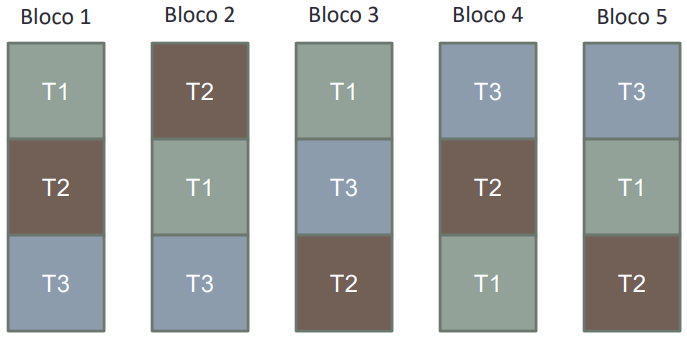
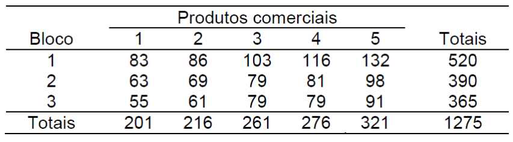

# Delineamento em Blocos Casualizados

## Introdução

- O Delineamento em Blocos Casualizados (DBC) envolve os
seguintes princípios experiemntais:
  - Repetição
  - Casualização
  - Blocagem

- Blocagem (Controle da Casualização):
  - Também conhecido como "Controle Local"
  - Aplicado quando as condições experimentais não são homogêneas em todas as unidades experimentais
  - Ou seja, existe algum nível de variação sistemática (fatores externos) que pode ser reconhecida no experimento

Exemplos:

1. Na Agronomia:
  Em estudos que são feitos a campo. Blocos são faixas do solo que apresentam maior homogeneidade.
  (Blocagem no espaço, como controle local).

2. Na indústria:
  Diferentes lotes de produção podem apresentar variações (matéria-prima, máquinas diferentes da unidade de produção, etc)
  Controle de qualidade da produção.
  (Blocagem em termos de lotes de produção)

3. No laboratório:
  Variações de material experimental, coletas, reagentes, etc.
  Em ensaios clínicos (idade, peso, sexo, etc).
  Dias diferentes de análise.

- Nestas condições o DBC torna-se mais eficiente do que o DIC:
  - Redução de Variabilidade Residual: Uma vez que as UE são organizadas em blocos homogêneos
  - Controle da Variação Sistemática: O efeito de blocos é computado no experimento e no modelo de análise
  - Aumento da Precisão: As comparações entre tratamentos são realizadas com maior precisão uma vez que a diferença entre os blocos é controlada

## Casualização em DBC

- A casualização é realizada de forma independente em cada bloco
- Todos os tratamentos devem aparecer em cada bloco
- n° blocos = n° repetições

- Atenção! Se não é possível alocar todos os tratamentos dentro dos blocos temos um Delineamento de Blocos Incompletos
  - Não será abordado nesta disciplina!
  
**Exemplo**

Suponha um experimento com três tratamentos e cinco repetições. No DBC cada bloco constituirá uma repetição. Em cada bloco deverá constar uma repetição de cada tratamento. Dentro de cada bloco os tratamentos deverão ser dispostos de forma casualizada. Esquematicamente o DBC fica caracterizado conforme a
figura abaixo:

```{r fig1, echo=FALSE, out.width="100%"}

```

**Exemplo2**

Os dados abaixo referem-se a um experimento instalado segundo o DBC. Foram testados 5 produtos comerciais para suprir a deficiência nutricional em caprinos. As unidades experimentais foram separadas em 3 grupos segundo a idade dos animais. Dentro de cada grupo os produtos foram distribuídos de maneira casualizada. Os resultados obtidos são expressos em ppm de nutriente/ml de sangue. Pede-se proceder a ANOVA e verificar a significância dos efeitos de tratamentos (Alfa=0,05).

```{r tab2, echo=FALSE, out.width="100%"}

```

**Interpretação**

- Variável Independente ou Fator em Estudo:
  - Produtos Comerciais (I = 5 níveis ou tratamentos)
  - Variável Qualitatitva
- Blocos:
  - Grupos de Idade (J = 3 blocos = 3 repetições)
  - Variável Qualitativa
- Número de Unidades Experimentais
  - N = I*J = 15
  
## Modelo Estatístico

yij = mu + ti + bj + eij

- Onde:

  yij = observação da variável resposta para o i-ésimo tratamento e a j-ésima repetição;
  mu = média geral;
  ti = efeito do i-ésimo tratamento;
  bj = efeito do j-ésimo bloco;
  eij = erro experimental com a pressuposição eij ~ NID(0; sigma^2^)

## Análise de Variância

- Vamos testar as hipóteses:
  - H0: m1=m2=m3=m4=m5
  - Ha: Pelo menos uma média é diferente das demais
  
- A técnica da ANOVA é uma decomposição da variância total nas variâncias dos efeitos do modelo.

- Portanto, vamos podemos realizar a decomposição por meio das Somas de Quadrados (SQ) para cada efeito (fonte de variação) do modelo :

- yij = m + ti + bj + eij

- SQTotal = SQTrat + SQBlocos + SQRes

- Na sequência podemos calcular os graus de liberdade relativos a cada fonte de variação do modelo:

- Graus de Liberdade:
  - gl(Total): N - 1 = 14
  - gl(Tratamentos): I - 1 = 4
  - gl(Blocos): J - 1 = 2
  - gl(Res) = gl(Total) - gl(Trat) - gl(Blocos) = 8

- Finalmente, os Quadrados Médios podem ser obtidos para cada fonte de variação do modelo:
  - QMTrat = SQTrat/gl(Trat)
  - QMBlocos = SQBlocos/gl(Blocos)
  - QMRes = SQRes/gl(Res)

- Os QM são as variâncias relativas a cada efeito do modelo.

- O Teste F permite verificar se o efeito dos tratamentos é mais importante que a variação residual
  - F = QMTrat/QMRes

## Análise no R

- A Análise de Variância em um DBC pode ser executada facilmente no R.

**1. Input de Dados**

- Podemos fazer a importação da base de dados através do comando `read.table`

```{r}
dados1 <- read.table("dados/dados_dbc.txt", h = TRUE)
dados1
```

- Uma rápida inspeção no dataframe nos indica que os vetores para tratamentos e blocos são números inteiros. Portanto, é necessário transfomá-los em fatores:

```{r trans1}

dados1 <- transform(dados1, trat = factor(trat), bloco = factor(bloco))
```

- Veja que também podemos realizar essa transdormação por meio dos comandos abaixo:

```{r}

dados1$trat <- as.factor(dados1$trat)
dados1$bloco <- as.factor(dados1$bloco)

```

**2. Análise Exploratória**

- Podemos iniciar a análise exploratória visualizando um histograma dos valores da variável resposta:

```{r hist2}
par(mfrow=c(2,1))
hist2 <- hist(dados1$y)
boxplot(dados1$y, horizontal = TRUE)
```

- Pelo histograma não podemos ter certeza de uma distribuição normal, porém também não podemos descartar essa possibilidade
- O gráfico boxplot também nos dá alguns indicadores da distribuição dos dados

- Também podemos obter um boxplot para cada tratamento

```{r box}

boxplot(y ~ trat, data = dados1, horizontal=TRUE)
boxplot(y ~ bloco, data = dados1, horizontal=TRUE)
boxplot(y ~ trat, data = dados1)

```

- A princípio a ditribuição dos dados parece ser homogênea entre os tratamentos
- O tratamento 5 exibe uma maior variação
- O tratamento 3 parece ser mais assimétrico

- Pela análise exploratória, podemos verificar que os dados em questão não devem apresentar violações graves das pressuposições do modelo. Iremos confirmar isso na análise de resíduos após a ANOVA

**3. Análise de Variância**

- É de fácil aplicação através do comando `aov`
- A função `summary` permite visualizar a tabela da ANOVA

```{r anova}

modelo1 <- aov(y ~ trat + bloco, data = dados1)
summary(modelo1)

modelo2 <- aov(y ~ trat, data = dados1)
summary(modelo2)
```

- O p-valor associado ao valor de Fcal para o efeito de tratamentos indica que podemos resjeitar a hipótese de nulidade de que as médias dos tratamentos seja iguais
- De fato, o QMTrat (772,5) é bem maior que o QMRes (23,0)
- Veja também que o efeito de blocos, ou seja, a variação entre os blocos também é alta. Embora não haja um interesse específico nessa variação, isso indica, de certa forma, que estamos corretos em organizar nosso experimento em blocos casualizados
- Uma interpretação final pode ser dada para o resultado da ANOVA:
  - "A ANOVA indica que os produtos comercias testados exercem efeito significativo na concentração do nutriente no sangue (p <0,05)"

**4. Análise de Pressuposições**

- Mais uma vez precisamos realizar a análise das pressuposições do erro experimental:
  - eij ~ NID(0;Sigma^2)^

- Podemos fazer isso graficamente:

```{r}

plot(modelo1, c(1,2))
```

- Além da análise gráfica, podemos utilizar:
  - Teste de Shapiro-Wilk (Normalidade)
  - Teste de Bartlett (Homogeneidade de Variâncias)
  
```{r}

shapiro.test(resid(modelo1))
bartlett.test(resid(modelo1) ~ trat, data= dados1)

```

**5.Coeficiente de Variação Experimental**

- Finalmente podemos interpretar o coeficiente de variação experimental

```{r}

library(agricolae)
cv.model(modelo1)
```

