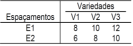
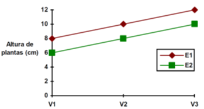
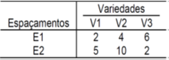
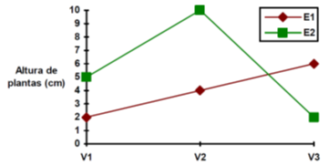
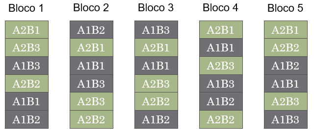
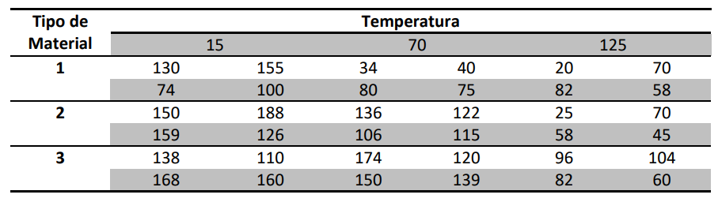

# Experimentos Fatoriais

## Introdução

- Experimentos Fatoriais são aqueles em que testamos simultaneamente dois ou mais fatores

- Os diferentes níves de cada fator também são estudados

- Exemplos:
  - Estudar o efeito da temperatura (30, 40 e 50 °C), do pH (baixo, médio e alto) no rendimento (mol/L) de uma reação química:
    - Dois fatores em estudo: 3 x 3 = 3^2^ = 9 tratamentos
  
  - Estudar três diferentes tipos de tinta para aviões (A, B e C) e dois diferentes métodos de aplicação (imersão e aspersão) na força de adesão (N/m)
    - Dois fatores em estudo: 3 x 2 = 6 tratamentos
    
  - Estudar o desempenho de quatro cultivares (A, B, C e D) em três ambientes (Rio Paranaíba, Cristalina e Sorriso)
    - Dois fatores em estudo: 4 x 3 = 12
    
- Veja que, as combinações dos níveis dos fatores é o número de tratamentos no estudo: IJ = N° de tratamentos

## Tipos de Efeitos

  - **Efeito Principal:** É o efeito individual de cada fator, independente do efeito de outros fatores
  - **Interação:** É o efeito conjunto para os fatores estudados. Ocorre interação quando o efeito de um fator influencia o efeito de outro fator
  
  
**Exemplo:** Considere um experimento fatorial 3x2, em que os fatores em testes são Variedade (V) e Espaçamento (E). Suponha os seguintes resultados fictícios, para a variável altura de plantas (cm), nas seguintes situações:

1. Não há interação entre Fatores:

  - Quando não há interação (ação independente) as diferenças entre os resultados dos níveis de um fator são estatisticamente iguais para todos os níveis do outro fator.
  
```{r fig2, out.width="30%", echo = FALSE}


```

2. Não há interação entre Fatores:

  - Quando há interação significicativa as diferenças entre os níveis de um fator dependem dos níveis do outro fator.

```{r fig3, out.width="30%", echo = FALSE}


```

## Casualização em Experimentos Fatoriais

Os experimentos fatoriais podem ser delineados tanto de forma inteiramente casualizada, como em blocos completos casualizados.

  - Significa dizer que podem ser organizados em DIC ou DBC

Vamos verificar um exemplo em DBC:

**Exemplo:** Suponha um experimento no esquema fatorial com dois fatores (A e B), dispostos em blocos casualizados, com 5 repetições. O fator A possui dois níveis (A1 e A2). O fator B possui três níveis (B1, B2 e B3). Cada combinação (AiBj) dos níveis de cada fator constituem o que chamamos de tratamentos. Como o delineamento utilizado é o DBC, devemos casualizar todos os tratamentos em cada bloco, conforme a figura abaixo:

```{r fig4, out.width="70%", echo = FALSE}

```

**Exemplo 1**

Considere que um engenheiro está desenvolvendo um modelo de bateria para uso em condições extremas de temperatura. Para tanto, estão sendo testados três tipos diferentes de materiais. Para verificar o desempenho destes materiais, e testar as condições de temperatura que devem influenciar a vida útil das baterias (em horas), o engenheiro decidiu realizar um ensaio com os três materiais (1, 2 e 3) em três níveis de temperatura (15, 70 e 125 °C). Para realizar o ensaio, conjuntos de quatro baterias foram testados em cada combinação de material e temperatura. Todos os testes foram conduzidos de forma completamente aleatorizada. Os resultados dos experimentos são dados na tabela abaixo.

```{r fig5, out.width="70%", echo = FALSE}

```

O modelo fatorial com a interação a ser utilizado será:

$$ y_{ijk}=\mu +\alpha _{i}+\beta _{j}+\alpha \beta_{ij}+\epsilon _{ijk}$$

1. Importação do Data Set

```{r datset}

(dados5 <- read.table("dados/dadosfat.txt",header=T))

```

2. Gráficos da Interação

- Por meio de comandos simples podemos investigar as possíveis interações presentes

```{r}

# Gráfico 1

interaction.plot(dados5$mat, dados5$temp, dados5$y, xlab="Tipo de Material", ylab="Vida Util")

# Gráfico 2
interaction.plot(dados5$temp, dados5$mat, dados5$y, xlab="Temperatura", ylab="Vida Util")
```

3. Análise de Variância

- A ANOVA e todos os testes subsequentes pode ser realizada facilmente pelo pacote `ExpDes.pt`

```{r anova6}

require(ExpDes.pt)

with(data = dados5,
     fat2.dic(mat, temp, y,
              quali=c(TRUE, FALSE),
              mcomp = "tukey",
              fac.names = c("Material","Temperatura")
              )
     )

```

### Outros Gráficos!

```{r}
#install.packages("tidyverse")
library(tidyverse)

dados6 <- dados5 %>%
  group_by(mat, temp) %>%
  summarise(media = mean(y,na.rm=T))
dados6

ggplot(dados6, aes(mat, media)) +
  geom_col(alpha = 0.8, position = "dodge") +
  facet_wrap(~temp) +
  theme_bw(16) +
  theme(axis.text.x = element_text(angle = 45, hjust = 1, vjust = 1))

```

